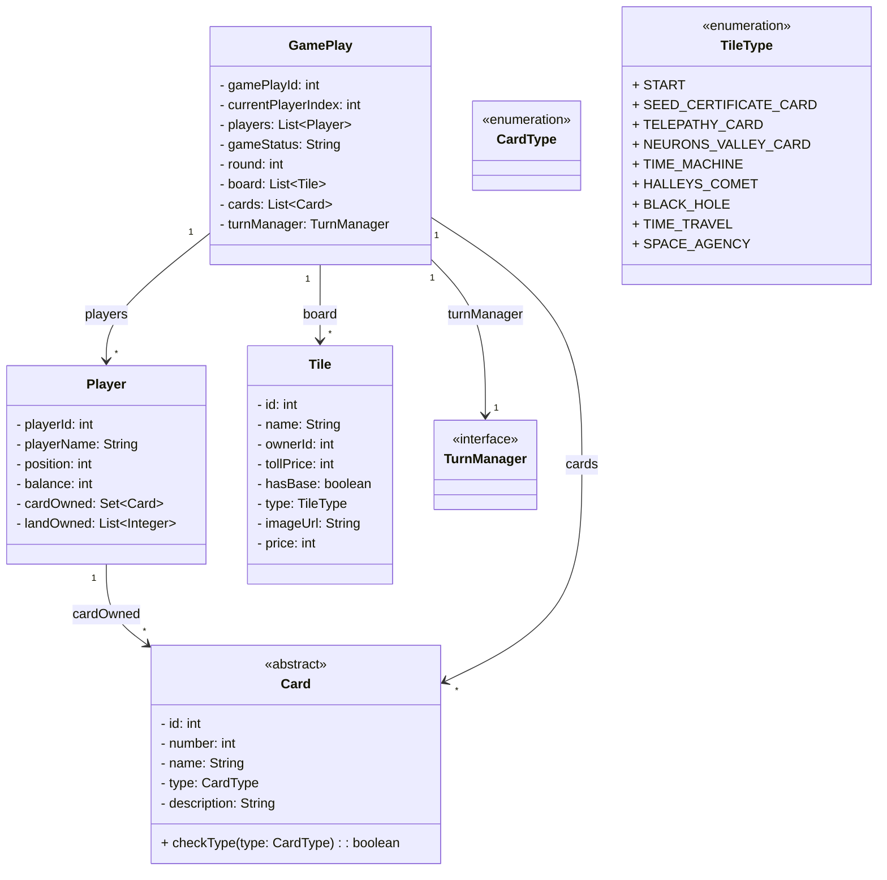

```mermaid
classDiagram
%% Player 클래스
    class Player {
        - playerId: int
        - playerName: String
        - position: int
        - balance: int
        - cardOwned: Set~Card~
        - landOwned: List~Integer~
    }

%% GamePlay 클래스
    class GamePlay {
        - gamePlayId: int
        - currentPlayerIndex: int
        - players: List~Player~
        - gameStatus: String
        - round: int
        - board: List~Tile~
        - cards: List~Card~
        - turnManager: TurnManager
    }

%% Card 추상 클래스
    class Card {
        <<abstract>>
        - id: int
        - number: int
        - name: String
        - type: CardType
        - description: String
        + checkType(type: CardType): boolean
    }

%% Tile 클래스
    class Tile {
        - id: int
        - name: String
        - ownerId: int
        - tollPrice: int
        - hasBase: boolean
        - type: TileType
        - imageUrl: String
        - price: int
    }

%% TurnManager 클래스 (상세 구현 생략)
    class TurnManager {
        <<interface>>
    }

%% CardType 열거형 (상세 구현 생략)
    class CardType {
        <<enumeration>>
    }

%% TileType 열거형
    class TileType {
        <<enumeration>>
        + START
        + SEED_CERTIFICATE_CARD
        + TELEPATHY_CARD
        + NEURONS_VALLEY_CARD
        + TIME_MACHINE
        + HALLEYS_COMET
        + BLACK_HOLE
        + TIME_TRAVEL
        + SPACE_AGENCY
    }

%% 클래스 간 관계
    Player "1" --> "*" Card: cardOwned
    GamePlay "1" --> "*" Player: players
    GamePlay "1" --> "*" Card: cards
    GamePlay "1" --> "*" Tile: board
    GamePlay "1" --> "1" TurnManager: turnManager

```