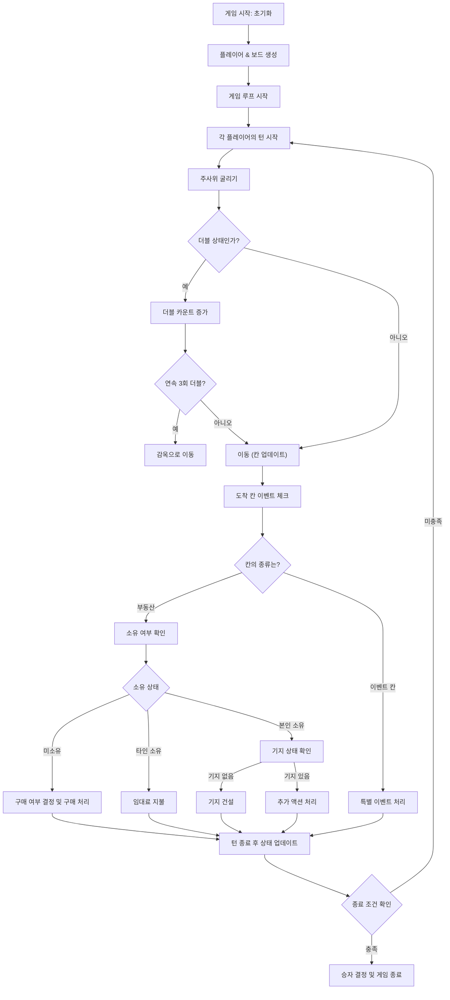

```mermaid
flowchart TD
    A[게임 시작: 초기화] --> B[플레이어 & 보드 생성]
    B --> C[게임 루프 시작]
    C --> D[각 플레이어의 턴 시작]
    D --> E[주사위 굴리기]
    E --> F{"더블 상태인가?"}
    F -- 예 --> G[더블 카운트 증가]
    G --> H{"연속 3회 더블?"}
    H -- 예 --> I[감옥으로 이동]
    H -- 아니오 --> J["이동 (칸 업데이트)"]
    F -- 아니오 --> J["이동 (칸 업데이트)"]
    J --> K[도착 칸 이벤트 체크]
    K --> L{"칸의 종류는?"}
    L -- 부동산 --> M["소유 여부 확인"]
    M --> N{"소유 상태"}
    N -- 미소유 --> O["구매 여부 결정 및 구매 처리"]
    N -- 타인 소유 --> P["임대료 지불"]
    N -- 본인 소유 --> Q["기지 상태 확인"]
    Q -- 기지 없음 --> R["기지 건설"]
    Q -- 기지 있음 --> S["추가 액션 처리"]
    L -- 이벤트 칸 --> T["특별 이벤트 처리"]
    O --> U["턴 종료 후 상태 업데이트"]
    P --> U
    R --> U
    S --> U
    T --> U
    U --> V{"종료 조건 확인"}
    V -- 미충족 --> D
    V -- 충족 --> W["승자 결정 및 게임 종료"]
```

